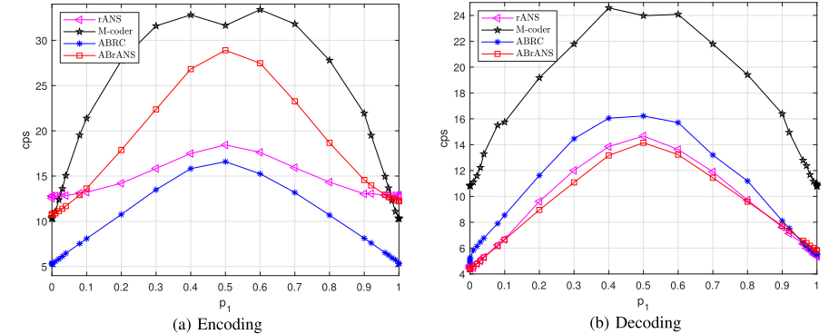
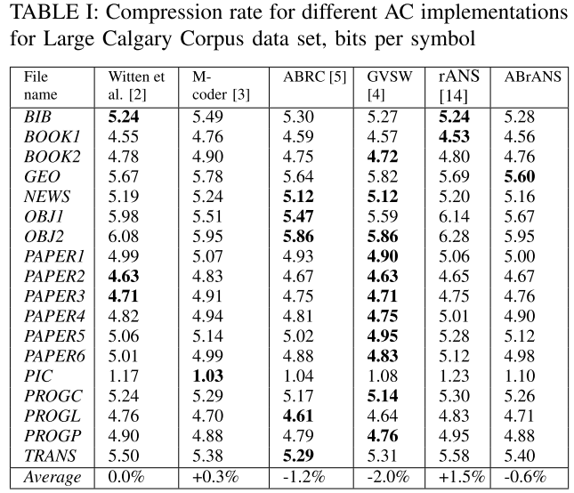
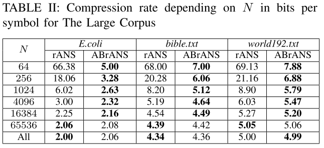

# ABrANS
We propose an adaptive binary implementation of the range version of Asymmetric Numeral Systems (rANS). The main difference with the classic rANS are the following:
1. As rANS encoder processes symbols in reverse order, we estimate the probabilities in forward order, store them into the encoder
memory, and use them during the reverse encoding. It guarantees that both the encoder and the decoder have exactly the same
probability estimation for each symbol.
2. We show how this approach can be implemented using probability estimation via Virtual Sliding Window (VSW).

# Performance Evaluation
ABrANS encoder requires two multiplications per input symbol and it needs addtional time to process the memory with the probabilities. Therefore, it is slower than the range coding (ABRC) and classic static rANS. On the other side, ABrANS decoder provides the fastest decoding comparing with the state-of-the-art adaptive binary coders. As a result, ABrANS is 1.5 faster in encoding, and 2.5 faster in decoding than M-Coder, respectively.   

At Large Calgary Corpus the proposed ABrANS provides better compression perforamce comparing with the classic rANS.

One more drawback of the static model in rANS is its low efficiency for relatively short sequences caused by storage of the normalized frequencies into the output bit stream. In order to illustrate it, we performed compression of the first N symbols of The Large Corpus data set. One can see that for N ≤ 16384 the compression performance of rANS is significantly lower due to the frequencies storage, i.e., the proposed adaptive approach is more efficient for short data blocks as well.

**References** 
[1] E.Belyaev, K. Liu, [An adaptive binary rANS with probability estimation in reverse order](https://ieeexplore.ieee.org/document/10283871), IEEE Signal Processing Letters, 2023.  
